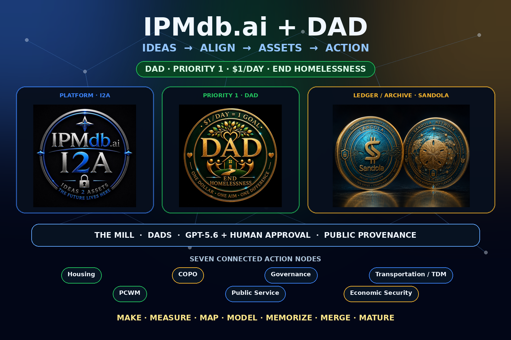
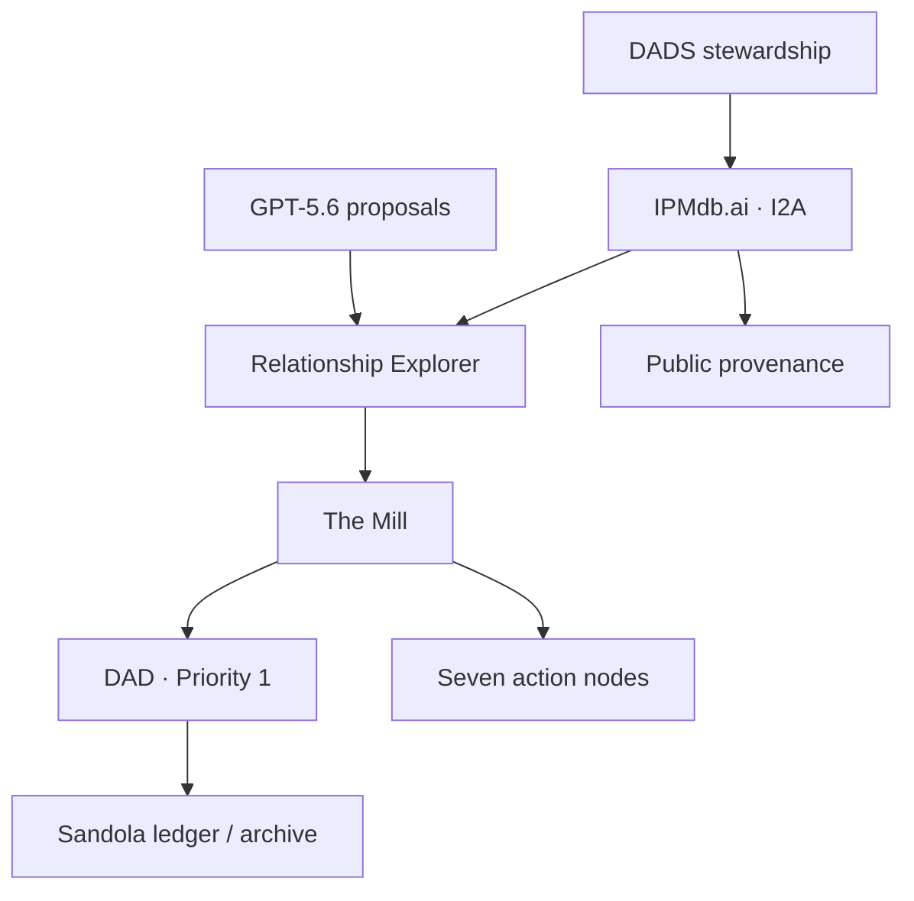

# IPMdb.ai + DAD

**Ideas → Align → Assets → Action**



IPMdb.ai is public-domain infrastructure for turning ideas into stable, connected, verifiable assets. DAD—Dollar a Day—is its Priority 1 flagship implementation: **$1/day, one goal, end homelessness**.

This is one living system. The Relationship Explorer maps ideas, evidence, dependencies, decisions, contributions, implementation, and outcomes. The Mill integrates the work. Seven action nodes organize public-interest domains. DADS provides stewardship. Sandola records contribution, evidence, implementation, attribution, and transparent reserves as a ledger/archive—not a speculative currency.

GPT-5.6 proposes relationships across the ecosystem while a human approves every write. Public SHA-256 provenance receipts preserve the trail.

## The system



### Seven action nodes

- Housing
- COPO — Court of Public Opinion
- Governance
- Transportation / TDM
- PCWM — Post-Consumer Waste Management
- Public Service
- Economic Security

### Seven Ms operating loop

**Make · Measure · Map · Model · Memorize · Merge · Mature**

## What judges can try

- Open the **System Map** and see how IPMdb.ai, DAD, DADS, Sandola, The Mill, the Seven Ms, and the seven nodes work together.
- Lock an idea and receive a stable `IPMDB-####` identifier.
- Open DAD and follow the Priority 1 implementation path from an asset.
- Explore the seeded ecosystem in the interactive Relationship Explorer.
- Search COPO, Housing, Sandola, or any other node without exposing submitter contact information.
- Generate a public HTML or JSON provenance receipt with stable content hashes.
- Ask GPT-5.6 to propose typed graph edges, then approve or reject every suggestion.
- Export relationships as JSON, CSV, Mermaid, GraphML, or Cytoscape data.

## Run it in one command

Requirements: Docker with Compose.

```bash
docker compose up --build
```

Open [http://localhost:8080/ipmdb/](http://localhost:8080/ipmdb/).

The judge environment contains a reproducible 17-asset ecosystem graph. Administrative features use local demo credentials only:

- Email: `judge@ipmdb.local`
- Password: `IPMdbBuildWeek2026!`

To exercise GPT-5.6, provide an API key before starting:

```bash
export OPENAI_API_KEY="your_api_key"
docker compose up --build
```

Production credentials are never committed. The checked-in values are isolated Docker demo credentials and must not be reused outside the local judge environment.

## GPT-5.6 and Codex

The private **AI Map** workflow sends only an asset's non-contact content and a bounded candidate set to the OpenAI Responses API. It uses `gpt-5.6`, strict Structured Outputs, known asset IDs, supported relationship types, and medium reasoning effort. Model output is a recommendation; a human administrator must approve an edge before IPMdb writes it.

Across this Build Week extension, Codex was used to:

- recover the graph client after a packaging error replaced JavaScript with CSS;
- trace data flow across PHP, SQL, and browser layers;
- remove committed production credentials and public PII exposure;
- add authentication, CSRF protection, rate limiting, safe errors, and portable configuration;
- integrate DAD, DADS, Sandola, The Mill, COPO, all seven nodes, and the Seven Ms into one public system map and reproducible graph;
- implement public provenance receipts and the GPT-5.6 human-review workflow;
- create a portable schema, ecosystem dataset, judge environment, and automated checks.

The integration follows the [official GPT-5.6 model documentation](https://developers.openai.com/api/docs/models/gpt-5.6-sol) and [Structured Outputs guide](https://developers.openai.com/api/docs/guides/structured-outputs).

## What changed during Build Week

IPMdb.ai existed before the July 13, 2026 submission period. The dated implementation is isolated in [pull request #90](https://github.com/ajfisherco/Ipmdb/pull/90).

| Before Build Week | Added or completed July 13–18, 2026 with Codex and GPT-5.6 |
|---|---|
| PHP/MariaDB idea intake, ledger, search, versions, and manual relationship routes | GPT-5.6 AI Map with bounded candidates, strict Structured Outputs, rationale, confidence, and human approval |
| DAD prototype, node documents, COPO, Sandola concepts, and broader ecosystem materials existed in separate surfaces | One public System Map plus a seeded relationship graph connecting DAD, DADS, Sandola, The Mill, seven nodes, Seven Ms, decisions, and outcomes |
| Packaged graph client could not run because its JavaScript had been overwritten by CSS | Restored graph client and repaired a truncated relationship-suggestion route |
| Server-specific configuration included legacy credentials and public queries returned submitter email | Environment configuration, credential removal, public-contact redaction, password hashes, expiring sessions, rate limiting, CSRF checks, and safe errors |
| No public cryptographic verification surface | SHA-256 provenance receipts in HTML and JSON |
| No reproducible judge environment | Docker Compose, MariaDB schema and ecosystem data, PHP/JavaScript/security checks, GitHub Actions, deployment notes, and demo materials |

The required Codex `/feedback` session ID will be included in the Devpost submission.

## Architecture

| Layer | Implementation |
|---|---|
| Public platform | IPMdb.ai / I2A — Ideas → Align → Assets |
| Graph operating system | Relationship Explorer |
| Integration | The Mill and the Seven Ms |
| Priority 1 implementation | DAD — Dollar a Day |
| Stewardship | DADS — Dollar A Day Society |
| Contribution record | Sandola ledger/archive |
| Action domains | Seven public-interest nodes |
| AI | OpenAI Responses API, `gpt-5.6`, strict JSON Schema, human approval |
| Verification | Public SHA-256 HTML and JSON provenance receipts |
| Runtime | PHP 8.3, Apache, MariaDB 11.4, browser JavaScript |
| Portability | Docker Compose or environment-driven Plesk deployment |

## Key routes

| Route | Purpose | Access |
|---|---|---|
| `/ipmdb/` | Lock an idea | Public |
| `/ipmdb/ecosystem.php` | View the complete system map | Public |
| `/ipmdb/dad/` | Open the DAD Priority 1 implementation | Public |
| `/ipmdb/ledger.php` | Browse assets | Public |
| `/ipmdb/relationship_explorer.php` | Explore the graph | Public |
| `/ipmdb/provenance.php?asset_id=IPMDB-0001` | Verify provenance | Public |
| `/ipmdb/provenance.php?asset_id=IPMDB-0001&format=json` | Machine-readable receipt | Public |
| `/ipmdb/ai_relationships.php?asset_id=IPMDB-0004` | Analyze DAD relationships with GPT-5.6 | Admin |
| `/ipmdb/admin.php` | Manage assets | Admin |

## Validate the submission

```bash
npm install
npm test
```

The test command parses every PHP file, validates the graph JavaScript, checks the schema and ecosystem seed, protects the complete architecture from omission, and scans tracked application files for common credential mistakes. GitHub Actions runs the same checks on every push and pull request.

## Production configuration

Use environment variables or copy `ipmdb/config.local.php.example` to the ignored `ipmdb/config.local.php`. At minimum, configure:

- `IPMDB_DB_DSN`, `IPMDB_DB_USER`, `IPMDB_DB_PASS`
- `IPMDB_ADMIN_EMAIL`, `IPMDB_ADMIN_PASSWORD_HASH`
- `OPENAI_API_KEY` for AI Map
- `IPMDB_OPENAI_MODEL` (defaults to `gpt-5.6`)
- `IPMDB_DAD_EMAIL`, `IPMDB_DAD_SQUARE_URL`

Never deploy the Docker demo passwords. Rotate any credential that has ever appeared in an exported package before deploying this branch.

## Submission material

- [Official-logo Build Week thumbnail](graphics/ipmdb-build-week-thumbnail-v2.png)
- [Build Week submission copy](BUILD_WEEK_SUBMISSION.md)
- [Under-three-minute demo script](DEMO_SCRIPT.md)
- [Plesk deployment checklist](ipmdb/DEPLOYMENT_STANDARD.md)

## License

Dedicated to the public domain under [CC0 1.0 Universal](LICENSE).
