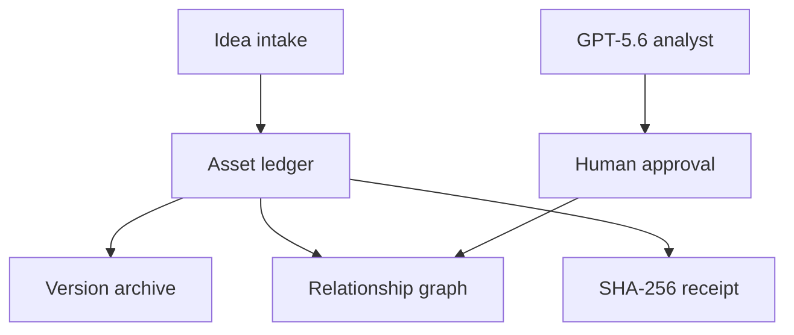

# IPMdb.ai

**Turn ideas into verifiable, connected assets.**

IPMdb is an idea-to-asset provenance ledger built for OpenAI Build Week 2026. It gives an idea a stable asset ID, preserves its version history, maps meaningful relationships, and produces a public SHA-256 provenance receipt without publishing the originator's email.

The project combines a working PHP/MariaDB application with a human-in-the-loop GPT-5.6 relationship analyst. Codex was used to recover, audit, harden, document, and test the submission codebase.

## Why it matters

Useful ideas are routinely buried in inboxes, documents, and chat threads. Conventional task tools track work, but they rarely preserve where an idea came from, how it changed, or which later outcomes depended on it.

IPMdb makes that chain visible:

`Idea → Asset ID → Version History → Relationship Graph → Provenance Receipt`

## What judges can try

- Lock an idea and receive a stable `IPMDB-####` identifier.
- Search the public ledger without exposing submitter contact information.
- Open an asset and inspect its history and connected assets.
- Explore the interactive Asset Domain Map.
- Generate a public HTML or JSON provenance receipt with stable content hashes.
- Ask GPT-5.6 to propose typed graph edges, then approve or reject every suggestion.
- Export relationships as JSON, CSV, Mermaid, GraphML, or Cytoscape data.

## Run it in one command

Requirements: Docker with Compose.

```bash
docker compose up --build
```

Open [http://localhost:8080/ipmdb/](http://localhost:8080/ipmdb/).

The seeded judge environment contains six sample assets and six relationships. Administrative features use local demo credentials only:

- Email: `judge@ipmdb.local`
- Password: `IPMdbBuildWeek2026!`

To exercise the GPT-5.6 feature, provide an API key before starting:

```bash
export OPENAI_API_KEY="your_api_key"
docker compose up --build
```

Production credentials are never committed. The checked-in values are isolated Docker demo credentials and must not be reused outside the local judge environment.

## GPT-5.6 and Codex

The private **AI Map** workflow sends only an asset's non-contact content and a bounded set of candidate assets to the OpenAI Responses API. It uses the `gpt-5.6` alias, Structured Outputs, a strict relationship schema, and medium reasoning effort. Model output is treated as a recommendation: a human administrator must approve an edge before IPMdb writes it.

Codex was used across the build to:

- recover the graph client after a packaging error replaced JavaScript with CSS;
- trace data flow across the PHP, SQL, and browser layers;
- remove committed production credentials and public PII exposure;
- add authentication, CSRF protection, rate limiting, safe error handling, and portable configuration;
- implement provenance receipts and the GPT-5.6 review workflow;
- create a reproducible schema, sample dataset, judge environment, and automated checks.

The GPT-5.6 model ID and Responses API integration follow the [official model documentation](https://developers.openai.com/api/docs/models/gpt-5.6-sol) and [Structured Outputs guide](https://developers.openai.com/api/docs/guides/structured-outputs).

## What changed during Build Week

IPMdb existed before the July 13, 2026 submission period as a PHP/MariaDB idea ledger with intake, search, versions, and manual relationship tooling. The Build Week entry is the meaningful extension documented in [pull request #90](https://github.com/ajfisherco/Ipmdb/pull/90) and its dated commit history.

| Before Build Week | Added or completed July 13–18, 2026 with Codex and GPT-5.6 |
|---|---|
| Idea intake, asset ledger, search, version records, and manual relationship routes | GPT-5.6 AI Map using the Responses API, strict Structured Outputs, bounded candidates, and human approval before writes |
| A packaged graph client that could not run because its JavaScript file had been overwritten by CSS | Restored interactive graph client and repaired a truncated relationship-suggestion route |
| Server-specific configuration containing legacy credentials and public queries that returned submitter email | Environment-driven configuration, credential removal, public-contact redaction, hashed admin authentication, expiring sessions, rate limiting, CSRF checks, and safer error handling |
| No public cryptographic verification surface | SHA-256 provenance receipts in human-readable HTML and machine-readable JSON |
| No reproducible judge environment or submission validation | Docker Compose, MariaDB schema and six-asset sample ledger, automated PHP/JavaScript/security checks, GitHub Actions, deployment notes, submission copy, and narrated demo script |

The core Build Week work is contained on the `build-week-2026` branch. The required Codex `/feedback` session ID will be included in the Devpost submission.

## Architecture



| Layer | Implementation |
|---|---|
| Web application | PHP 8.3 and Apache |
| Data | MariaDB 11.4 with reproducible schema and seed |
| Graph | Dependency-free browser JavaScript and CSS |
| AI | OpenAI Responses API, `gpt-5.6`, strict JSON Schema |
| Security | Password hashes, session expiry, CSRF tokens, rate limits, privacy-safe public queries |
| Portability | Docker Compose or environment-driven Plesk deployment |

## Key routes

| Route | Purpose | Access |
|---|---|---|
| `/ipmdb/` | Lock an idea | Public |
| `/ipmdb/ledger.php` | Browse assets | Public |
| `/ipmdb/viewer.php?asset_id=IPMDB-0001` | View an asset | Public |
| `/ipmdb/relationship_explorer.php` | Explore the graph | Public |
| `/ipmdb/provenance.php?asset_id=IPMDB-0001` | Verify provenance | Public |
| `/ipmdb/provenance.php?asset_id=IPMDB-0001&format=json` | Machine-readable receipt | Public |
| `/ipmdb/ai_relationships.php?asset_id=IPMDB-0001` | GPT-5.6 analysis | Admin |
| `/ipmdb/admin.php` | Manage assets | Admin |

## Validate the submission

```bash
npm install
npm test
```

The test command parses every PHP file, validates the graph JavaScript, checks the schema and seed, and scans tracked application files for common credential mistakes. GitHub Actions runs the equivalent checks on every push and pull request.

## Production configuration

Use environment variables or copy `ipmdb/config.local.php.example` to the ignored `ipmdb/config.local.php`. At minimum, configure:

- `IPMDB_DB_DSN`, `IPMDB_DB_USER`, `IPMDB_DB_PASS`
- `IPMDB_ADMIN_EMAIL`, `IPMDB_ADMIN_PASSWORD_HASH`
- `OPENAI_API_KEY` for AI Map
- `IPMDB_OPENAI_MODEL` (defaults to `gpt-5.6`)

Never deploy the Docker demo passwords. Rotate any credential that has ever appeared in an exported package before publishing that package or deploying this branch.

## Submission material

- [Build Week submission copy](BUILD_WEEK_SUBMISSION.md)
- [Under-three-minute demo script](DEMO_SCRIPT.md)
- [Plesk deployment checklist](ipmdb/DEPLOYMENT_STANDARD.md)

## License

Dedicated to the public domain under [CC0 1.0 Universal](LICENSE).
